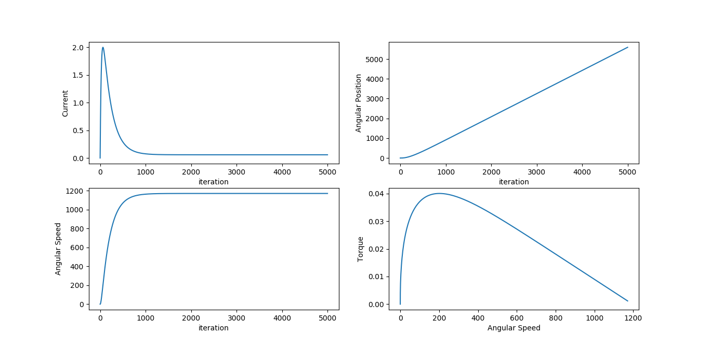
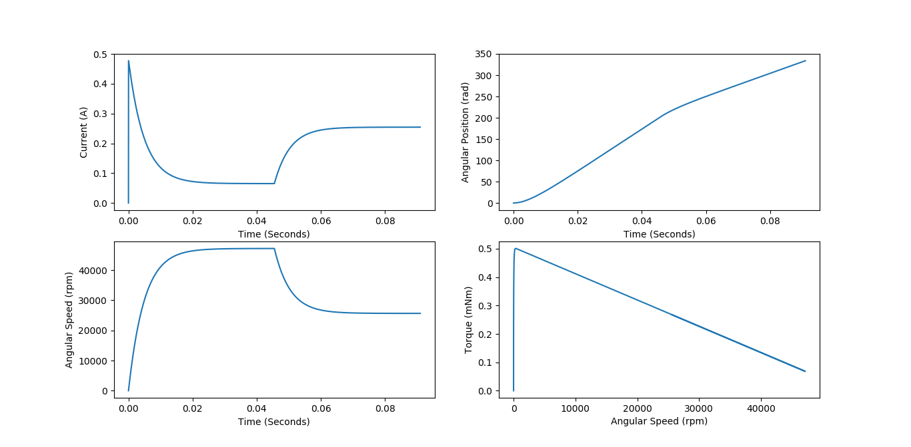
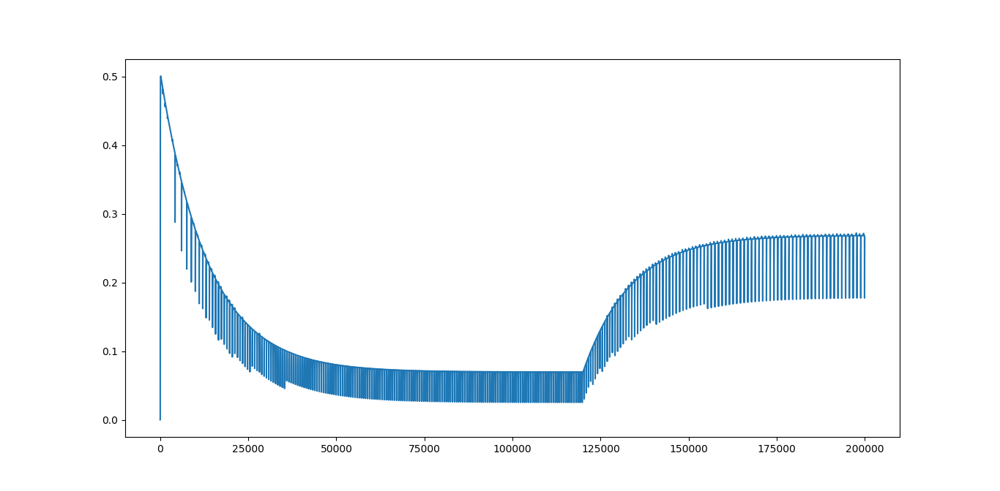
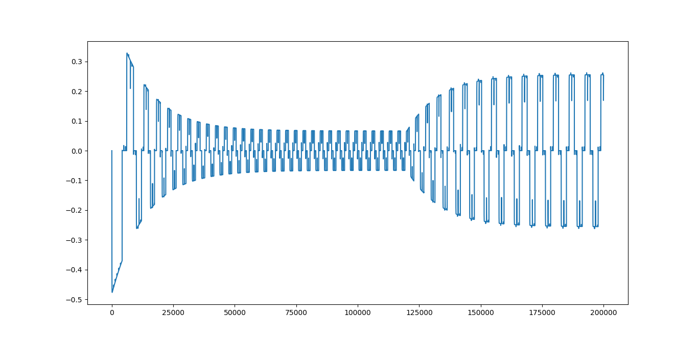

# Modelling of Motors

Folder contains modelling of DC, BLDC , and Stepper Motor. The model for the simulation for the respective motor are based on the following references:
1) DC - http://webfiles.portal.chalmers.se/et/MSc/BaldurssonStefanMSc.pdf
2) BLDC - http://webfiles.portal.chalmers.se/et/MSc/BaldurssonStefanMSc.pdf
3) Stepper Motor(Permanent and Hybrid) -

The Differential Equation are solved using the Euler Method, therefore special care has to be given to the delta_time variable as it should small to accurately solve the differentail equation.
Reference: Lec 2 | MIT 18.03 Differential Equations, Spring 2006 (https://www.youtube.com/watch?v=LbKKzMag5Rc) 

# Verifying the Model

### DC Motor

#### Parameters:

V = 24

R = 10

L = 0.24

b = 0.000001

kb = 0.02

kt = 0.02

I_motor = 9e-6

I_load = 0.

N = 1

n = 1

delta_t = 0.001
   
T_load = 0.

#### Parameters(As per reference)

V = 6.

R = 12.50

L = 0.091e-3

b = 1.38e-8

kb = 1.05e-3

kt = 1.05e-3

I_motor = 0.005e-7

I_load = 0.

N = 1

n = 1

delta_t = L/(R*4)

T_load = 0.

### BLDC Motor

#### Parameters(As per reference)

V = 6.

R(Phase to Phase) = 12.50

L(Phase to Phase)  = 0.091e-3

b = 1.38e-8

kb = 1.05e-3

kt = 1.05e-3

I_motor = 0.005e-7

I_load = 0.

N = 1

n = 1

delta_t = L/(R*4)

T_load = 0.

Torque Vs Time

Phase Current Vs Time

